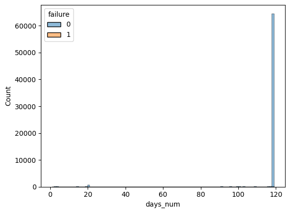
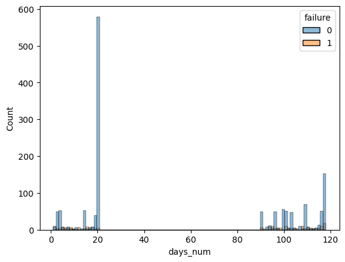
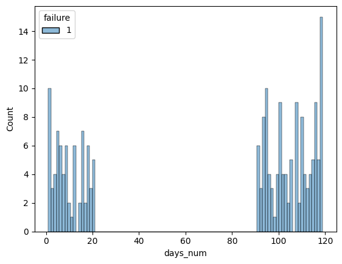
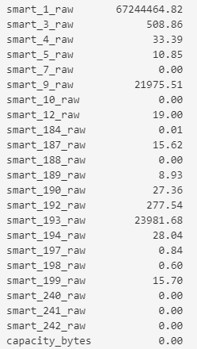
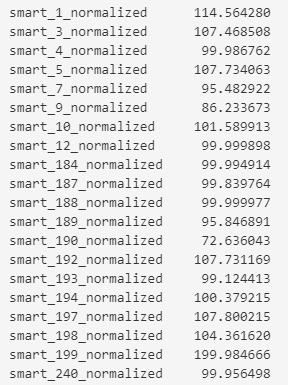

## Анализ данных (тестовые датасеты)

### Датасет Hard Drive Test Data

**Ссылка**: https://www.kaggle.com/datasets/backblaze/hard-drive-test-data

**Описание с kaggle**: Каждый день Backblaze делает снимок каждого работающего жесткого диска, который включает в себя основную информацию о жестком диске (например, емкость, неисправность) и статистику S.M.A.R.T. по каждому диску. Этот набор данных содержит данные за первые два квартала 2016 года. Этот набор данных содержит базовую информацию о жестком диске и 90 столбцов или необработанных и нормализованных значений 45 различных статистических данных S.M.A.R.T. 

Каждая строка представляет собой ежедневный снимок одного жесткого диска:
* date: Date in yyyy-mm-dd format
* serial_number: Manufacturer-assigned serial number of the drive
* model: Manufacturer-assigned model number of the drive
* capacity_bytes: Drive capacity in bytes
* failure: Contains a “0” if the drive is OK. Contains a “1” if this is the last day the drive was operational before failing.
* 90 variables that begin with 'smart': Raw and Normalized values for 45 different SMART stats as reported by the given drive

Некоторые моменты, которые следует учитывать при обработке данных:
* Значение статистики S.M.A.R.T. может различаться в зависимости от производителя и модели. Возможно, более информативным будет сравнение накопителей, схожих по модели и производителю
* Некоторые столбцы S.M.A.R.T. могут содержать значения за пределами допустимых значений
* При сбое диска столбцу "сбой" в день сбоя присваивается значение 1, и, начиная со следующего дня, диск будет удален из набора данных. Кроме того, каждый день добавляются новые диски. Это означает, что общее количество дисков в день может меняться.
* S.M.A.R.T. 9 - это количество часов, в течение которых диск использовался. Чтобы рассчитать срок службы диска в днях, разделите это число на 24.

**Выводы**:
1. Было замечено ряд особенностей в составе данных ВР: 
* В частности наблюдение первого дня 01.01.2016 дублируется для всех серийных номеров. 
* Также пропущены значения за период февраль-март 2016. Это делит текущую выборку на две части: до 22.01.2016 и с 01.04.2016 по 30.04.2016 (см. рис.1). Почти все серийные номера (> 600 тыс.) не сломались и по ним есть данные, при этом только 15 ломаются в последнюю дату (см. рис.3). 
* (?) Не понятно почему есть наблюдения, по которым данные обрываются без выставления таргета равного 1 (см. рис.2)

 

 

**Результат анализа:** 

Итоговая выборка будет содержать данные как на рис.2, где диски, которые работали на всем периоде, будут проигнорированы за исключением 1000 наблюдений. Код для создания выборки следующий:


import os 
os.chdir('H:/Projects_folder/autolabeling_time_series_data/')

```
import pandas as pd
import numpy as np
from datetime import datetime as dt

import matplotlib.pyplot as plt
import seaborn as sns

raw_data = pd.read_csv('data/kagglehub/datasets/backblaze/hard-drive-test-data/versions/1/harddrive.csv')

target_and_date_df = raw_data.loc[:, ['serial_number','failure']].drop_duplicates(keep='last').reset_index()
target_and_date_df['target_last_date'] = target_and_date_df['index'].apply(lambda i: raw_data.loc[i, 'date'])

target_and_date_df_1 = target_and_date_df[target_and_date_df.target_last_date != '2016-01-01']

target_and_date_df_1.loc[:,'days_num'] = target_and_date_df_1.loc[:,'target_last_date'].apply(lambda x: (pd.to_datetime(x) - pd.Timestamp('2016-01-01')).days )

sn_before_118 = target_and_date_df_1.loc[(target_and_date_df_1.days_num <= 118)|(target_and_date_df_1.failure==1), 'serial_number'].to_list()
sn_add_after_118 = target_and_date_df_1.loc[(target_and_date_df_1.days_num > 118)|(target_and_date_df_1.failure!=1), 'serial_number'].sample(n=1000, random_state=21).to_list()
sample_sn1 = sn_before_118+sn_add_after_118

sample1_sn = raw_data.loc[raw_data.serial_number.isin(sample_sn1)]

fetures_nan_median = sample1_sn.notna().sum().median()
nan_df = sample1_sn.notna().sum()
nan_df = nan_df[nan_df > fetures_nan_median]

sample1_sn.loc[:,nan_df.index.to_list()].to_excel('data/kagglehub/datasets/backblaze/hard-drive-test-data/dataset.xlsx')

```

## Получение/Формирование признаков из датасета

### Датасет Hard Drive Test Data

#### Анализ пропусков
На предыдущем шаге было отобрано 43 числовых переменных, не считая 5 переменных (3 категориальных, таргет и столбец с индексами). В рамках предварительного анализа пропущенных значений было получено, что большинство переменных, как и предполагалось, не содержат большого числа пропусков, а именнно 34 из 48 полностью лишены пропусков.

рис.4. График пропусков  

#### Качественный анализ 
Однако, было получено, что несмотря на привлекательность нормализованных значений в них содержиться недопустимые ошибки и неточности как на рис. ниже:

рис.5. Ошибки в данных 1 

рис.6. Ошибки в данных 2 

#### PCA анализ

Анализ PCA подтвердил, что нормализованные данные не могут быть использованы. Как видно из результатов, метод на меньшем числе данных показывает почти 100% объясненную дисперсию, что может говорить как о меньшей волатильности, так и близость большинства значений к нулю 0 или другому числу. Для проверки последней были вычислены средние значения. 

Результат raw ~ 2925712 
Результат norm ~ 105 


рис.7. PCA raw колонок 

рис.8. PCA norm колонок 

